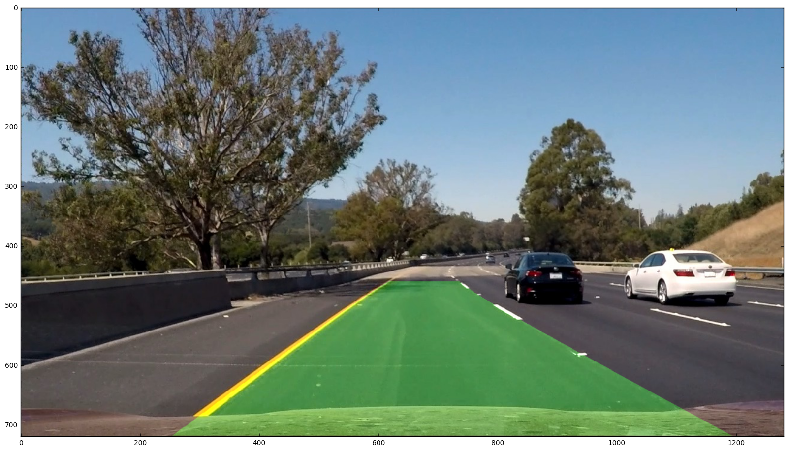

# Udacity Self-Driving Car Nanodegree: Term 1
# Project 4: Advanced Lane Lines

## Introduction
This is a project for Udacity's Self-Driving Car Nanodegree. It uses computer vision techniques to detect lane lines in front of a moving car and estimate the radius of curvature of the lane and distance of the car from the center of the lane.

## Concepts and Classes
Concepts explored in this project:

  - Camera distortion and calibration
  - Perspective transforms
  - Color spaces
  - Sobel gradients
  - Radius of curvature

## Getting Started
To view the output video, click [here](https://youtu.be/Y6a7cMIjWjA).

To view the code, open `advancedLaneLines.html` in a web browser.

To view and run the code, open `advancedLaneLines.ipynb` in a Jupyter Notebook. Running the code requires having the following libraries installed:

  - Python 3
  - `IPython`
  - `numpy`
  - `cv2`
  - `glob`
  - `matplotlib`
  - `moviepy`

## Camera Calibration

Images of a 9x6 chessboard were included in the camera_cal folder. To calibrate the camera:

1. Image paths are read into an array using the glob API
2. Images are then read into an array using `cv2.imread`
3. The program loops through all of the images in the array, and finds the chessboard corners using `cv2.findChessboardCorners`
4. These points are stored in an array called `imgpoints`, and their corresponding chessboard corner points are stored in an array called `objpoints`.
5. The distortion coefficients of the camera are found using `cv2.calibrateCamera`, passing in `objpoints` and `imgpoints` as arguments

The distortion coefficients found from the camera calibration can then be used to undistort images. Below is an example of a chessboard image before and after distortion. The distorted image clearly has a radial distortion, which the undistorted image has removed.

## Perspective transform

The next step was to find the matrices for the perspective transform and inverse transform, to create a "birds eye" view of the lanes from which to judge lane curvature. To find these::

1. Two "straight line" image paths are read from the folder `test_images` using the glob API
2. Images are read into an array using `cv2.imread`
3. 4 points forming a trapezoid on the lanes are identified as source points for the image warp
4. 4 points forming a rectangle are identified as the destination for these points
5. `cv2.getPerspectiveTransform` is used to find both `M` (the matrix for warping the original image) and `Minv` (the matrix for unwarping the warped image)

Original and warped images can be found below, with the source and destination points marked in red.

## Image Processing

Next, the images are processed using color thresholding to identify the lanes:

1. Image paths for turn images are stored into an array using the glob API, and images are read into an array using `cv2.imread`
2. Images are converted to YUV colorspace
2. To identify the white lines, the Y channel is thresholded at >200
3. To identify the yellow lines, the difference between the U channel and V channel is calculated (U-V) and thresholded at >30.
4. An element-wise "or" is applied to these images, so any pixel meeting either of these criteria is highlighted in white, while all other pixels are black.

Original and binary images are shown below, with the lane lines clearly visible.

## Warping and Region Masking

Processed images are warped using the `M` warping matrix found before. A region mask is applied to points closer to the lateral edges of the image to eliminate noise.

Binary and warped/masked images are show below.

## Locating Lane Lines

The bases of the lane lines are located using a histogram of the columns of the lower half of the warped binary image.

Images and histograms are shown below - peaks on the histogram identify the location of the base of the lane lines.

## Identifying Lane Lines and Curve Fitting

Points on the lane lines are identified using a "moving windows" technique. Rectangular windows are placed at the bottom of the image, centered at each histogram peak. Points that fall within either window are identified as belonging to that lane. If there are enough points identified, then the center for the next window is set at the mean of those points.

Windows are then stacked on top of the previous windows, and this process is repeated.

Once the points in the lane lines are identified, second-order polynomials are fit to those points using `np.polyfit`. These curves are calculated in units of both pixels and meters, using unit conversions of of:

For the x dimension: 3.7 m = 426 px

For the y dimension: 30 m = 720 px

Windows, lane points, and curves are show below. Windows are shown in green, left lane points are shown in red and right lane points are shown in blue. Best fit curves are plotted on top of them in yellow.

## Filling in the lane

Once the best-fit curves are identified, `cv2.Polyfill` is used to fill in the space between them in green. Then that filled in lane is unwarped and combined that with the original (undistorted) image using `cv2.addWeighted` to highlight the lane line on the original image in green.

An original image with the lane line overlaid on top is shown below.

## Calculating Position

The best-fit curves found previously are used to find the distance between the base of the lane lines, and the middle of the lane is calculated as the midpoint of those points. The distance of the middle of the lane from the center of the image is then calculated as the position of the car relative to the center of the lane

## Calculating Radius of Curvature

Given a second-order polynomial of the form:

the radius of curvature can be calculated using the formula:

This formula is used to convert the radius of curvature for each lane line at the base of the lane lines. Those values are then averaged to give the radius of curvature for the lane.

## Displaying Information

Once the lane position and radius of curvature are calculated, they are displayed on the filled image using `cv2.putText`. A sample image is show below.

## Pipeline

The steps detailed above were all included in the video pipeline, using `moviepy.editor.VideoFileClip` to read in each image in the original video file, apply the steps above, and output the image into a new video file.

To smooth out noise in the radius of curvature measurements, outliers (values greater than 5000 m or less than 200 m) were removed, and a moving average was applied over the previous 20 values.

Output video is saved as `output_video.mp4`.

## Discussion/Next Steps

The pipeline as it is works fine on the project video, but isn't very robust to more challenging conditions, especially when no lane line points are found in an image. Making it more robust, with being able to throw away outliers and use previous calculations, is a logical next step. This could be done more robust outlier removal (especially when finding the lane lines), and using previous lane measurements to influence where to look for the next lane.

Another issue is that there is a lot of noise in the coefficients for the best-fit curve, and this noise translates to noise in the calculation for the radius of curvature. This could perhaps be mitigated by applying damping or low-pass filters to curve radius values, in addition to a moving average.

And finally, the lanes could be identified more robustly by using more criteria and weighting those properly - even, perhaps, by labeling lanes by hand and using previously learned machine learning approaches to identify them in future images.
